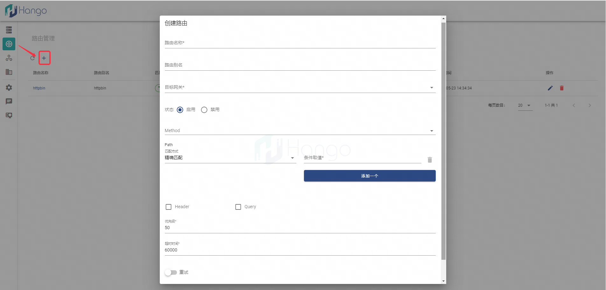

# 快速上手

> 支持版本: v1.3.0+

## 一、界面操作形式

### 1.访问Hango前端界面

Hango默认安装方式下，为hango-ui Pod暴露NodePort类型Service，通过如下命令获取对应端口，您可以通过`服务器IP:NodePort`形式访问Hango界面
```shell
kubectl get svc -n hango-system hango-ui
```

### 2.创建虚拟网关

通过`虚拟网关管理`界面创建虚拟网关，其中监听端口为Envoy暴露的访问端口，域名信息将为后续的服务路由所用(必要信息)


### 3.创建服务

通过`服务管理`界面创建服务数据，由上述步骤创建虚拟网关后，可以在虚拟网关选择栏中看到，选择后继续填写发布信息


选择服务的来源（k8s\Eureka\Nacos），并选择服务关联的域名，域名来源于虚拟网关；在更多配置中可以选择版本配置和连接配置等更多信息，填写完成后点击确认即可完成一个服务的发布


### 4.创建路由

通过`路由管理`界面创建路由数据，包括路由的path等各个维度的匹配规则



每一条路由都需要与服务进行关联；路由配置框中选择了目标网关后，才可以进行服务关联的操作，当前支持路由关联一个或多个服务（仅支持HTTP类型服务），从而达到服务灰度的效果；全部配置填写完成后点击确认，若路由状态为`启用`则正常创建一条路由数据


### 5.访问路由

前提：网关地址已暴露到集群外，否则仅在集群内可访问

获取网关信息后可通过如下命令对网关进行访问

> 网关地址 = Envoy暴露地址:创建的虚拟网关端口

```shell
curl "{{ 网关地址 }}/{{ 路由path }}" -H "{{ 网关域名 }}"
```

## 二、命令行操作形式

见 OpenApi 文档