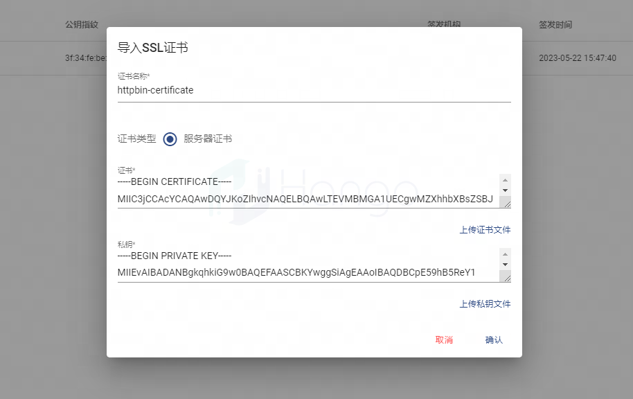
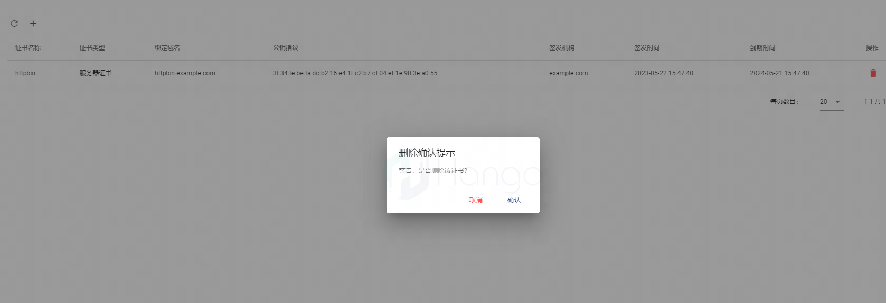

# SSL 证书管理

> 支持版本: v1.4.0+

## 1.证书的概念
SSL证书是一种数字证书，用于验证网站身份并为网站提供加密通信。它是由受信任的第三方机构颁发的，包含网站的公共密钥和其他信息。当用户访问使用SSL证书的网站时，浏览器会与网站建立加密连接，确保数据传输过程中的安全性和隐私性。
## 2.创建证书
### 2.1 创建用于服务签名的根证书和私钥
```shell
openssl req -x509 -sha256 -nodes -days 365 -newkey rsa:2048 -subj '/O=example Inc./CN=example.com' -keyout example.com.key -out example.com.crt
```
### 2.2.以httpbin.example.com为例，创建服务器证书和私钥
```shell
openssl req -out httpbin.example.com.csr -newkey rsa:2048 -nodes -keyout httpbin.example.com.key -subj "/CN=httpbin.example.com/O=httpbin organization"
```
```shell

openssl x509 -req -sha256 -days 365 -CA example.com.crt -CAkey example.com.key -set_serial 0 -in httpbin.example.com.csr -out httpbin.example.com.crt
```
### 2.3.上传证书
上传的证书文件以crt为后缀，上传的私钥文件以key为后缀的文件

## 3.删除证书
创建完成的证书可以被删除，但是已经绑定了域名的证书不允许被删除

