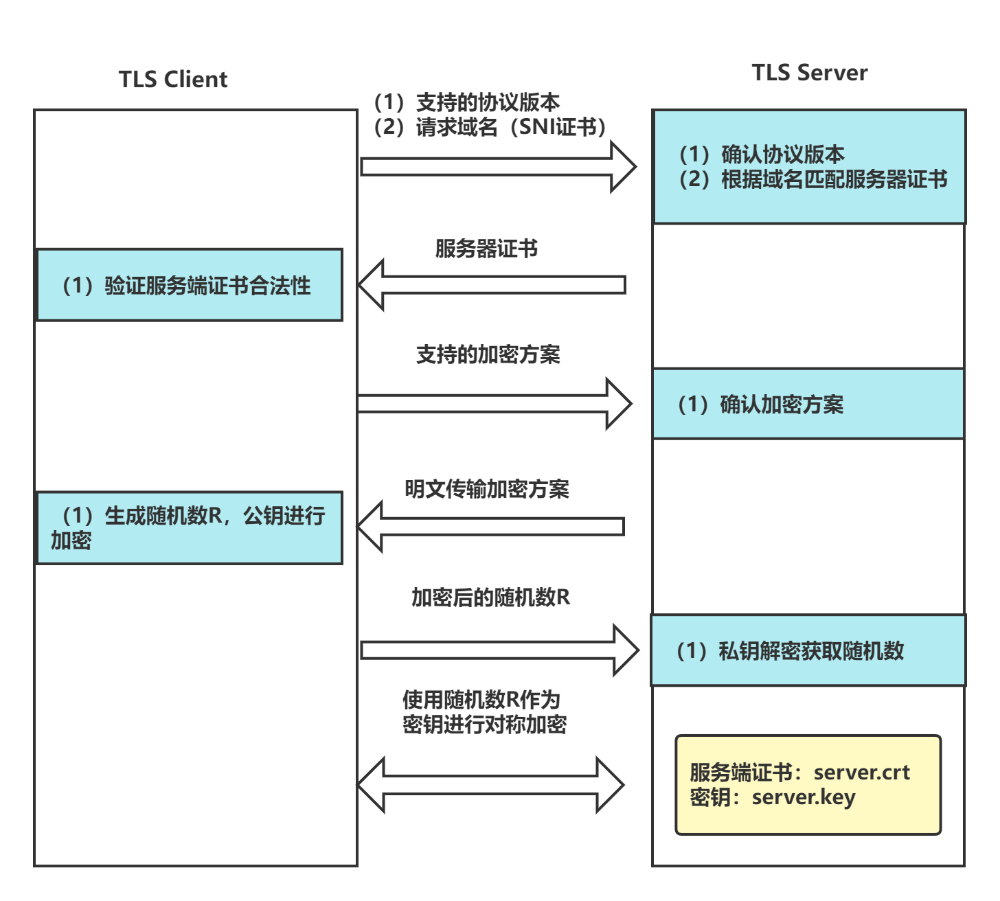
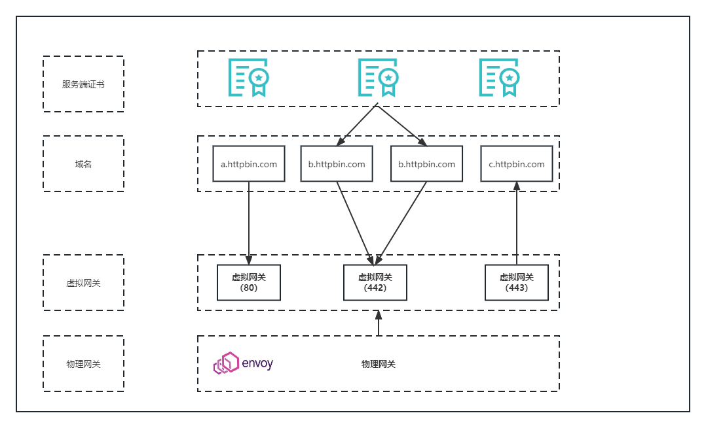
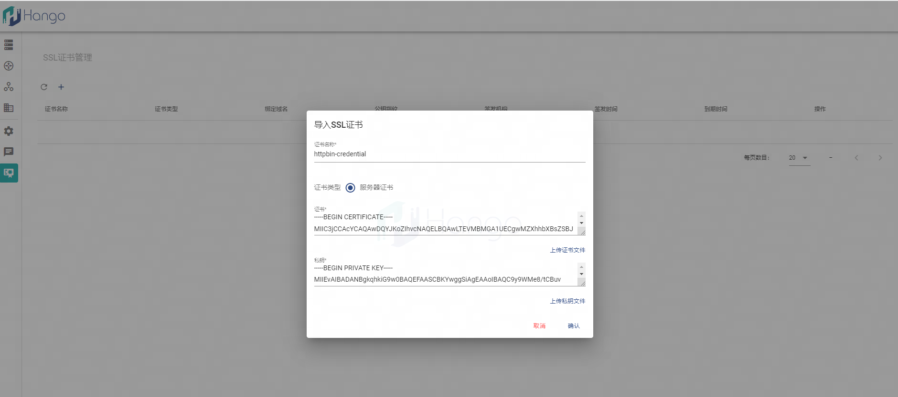
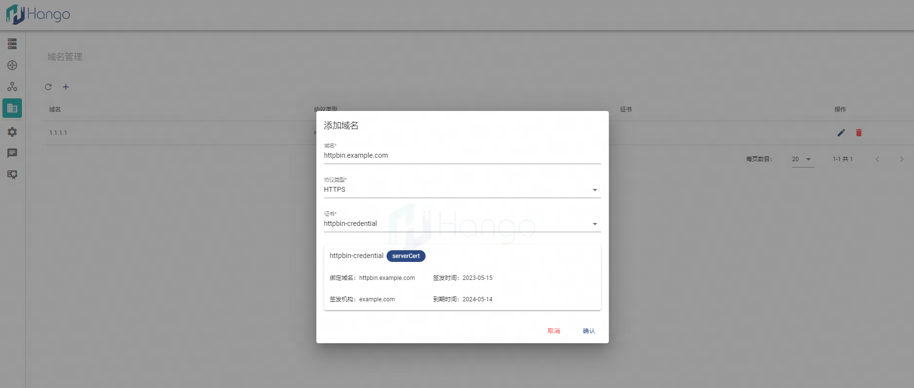
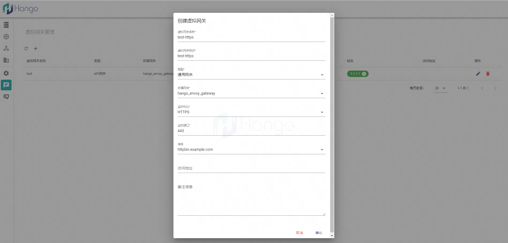
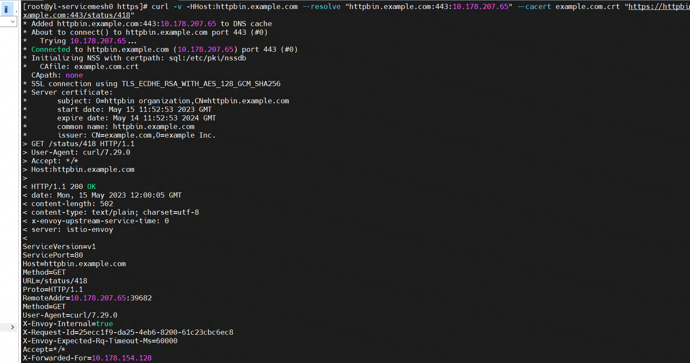

# 虚拟网关支持单向TLS协议
## 1.域名的概念
Https协议大家都不陌生，一般可以理解为HTTP+TLS，主要是在Http协议的基础上通过TLS证书验证服务器的身份，并为C/S之间的通信进行加密，从而提升数据传输的安全性。HTTPS默认工作在TCP协议的443端口。
* TLS
  TLS协议在握手阶段使用非对称加密算法，握手成功后采用相同密钥使用对称加密算法。具体可以分为单向TLS和双向TLS（mTLS）
* 单向TLS协议仅需要在客户端验证服务端证书的有效性，握手流程如下图所示，用户需要上传服务端证书和密钥。

## 2.功能架构图
功能架构图如下图所示，用户需要在服务端生成TLS证书，一个正式可以绑定多个子域名，最后在创建虚拟网关的时候关联已经域名即完成```虚拟网关-域名-证书```的关联关系。

## 3.操作步骤
### 3.1 创建用于服务签名的根证书和私钥
```shell
openssl req -x509 -sha256 -nodes -days 365 -newkey rsa:2048 -subj '/O=example Inc./CN=example.com' -keyout example.com.key -out example.com.crt
```
### 3.2.以httpbin.example.com为例，创建服务器证书和私钥
```shell
openssl req -out httpbin.example.com.csr -newkey rsa:2048 -nodes -keyout httpbin.example.com.key -subj "/CN=httpbin.example.com/O=httpbin organization"
```
```shell

openssl x509 -req -sha256 -days 365 -CA example.com.crt -CAkey example.com.key -set_serial 0 -in httpbin.example.com.csr -out httpbin.example.com.crt
```
### 3.3.平台上传服务器证书和私钥


### 3.4. 添加域名并绑定该证书


### 3.5. 创建虚拟网关并绑定域名


### 3.6. 请求携带证书访问
```shell
curl -v -HHost:httpbin.example.com --resolve "httpbin.example.com:443:10.178.207.65" --cacert example.com.crt "https://httpbin.example.com:443/status/418"
```
