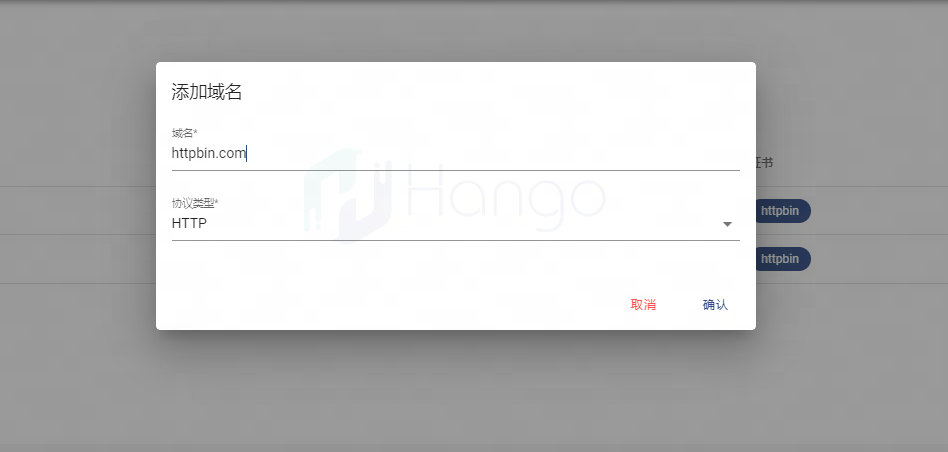
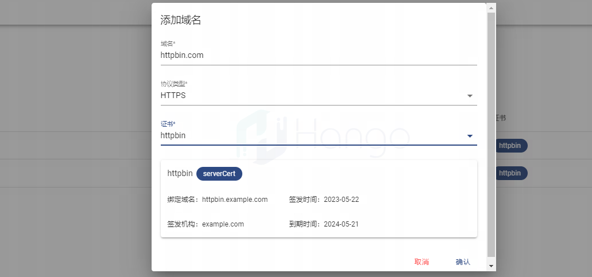
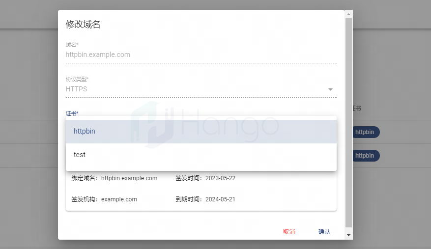
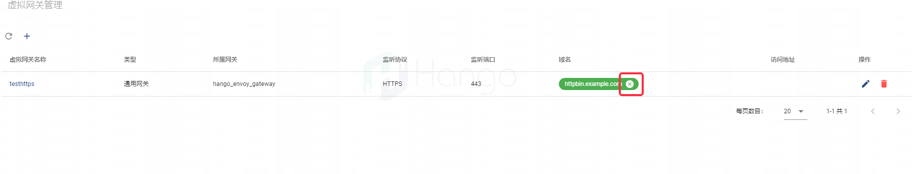
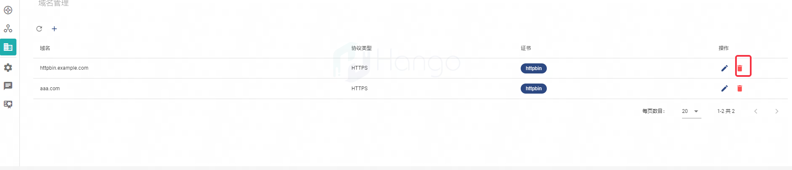

# 域名管理

> 支持版本: v2.1.0+

## 1.域名的概念
在请求网关时，请求头Header需要携带host指定了要访问的主机名或IP地址,它告诉服务器请求的目标是哪个域名或IP地址。
而一个虚拟网关下可以关联多个Host，任意一个Host都能匹配到该虚拟网关的流量。为了提高网关的可维护性和可扩展性，网关新增域名管理模块管理目标服务器的地址。
## 2.创建域名
域名管理中可以创建HTTP与HTTPS的域名，在创建HTTP时不需要绑定证书。而创建HTTPS的域名时需要关联证书管理中绑定了该域名的证书。

## 3.修改域名
HTTP与HTTPS的域名不可修改，但可以修改HTTPS域名所绑定的证书

## 4.删除域名
已经被虚拟网关所关联的域名不可被删除，因此在删除域名之前需要在虚拟网关中取消对域名的关联。

