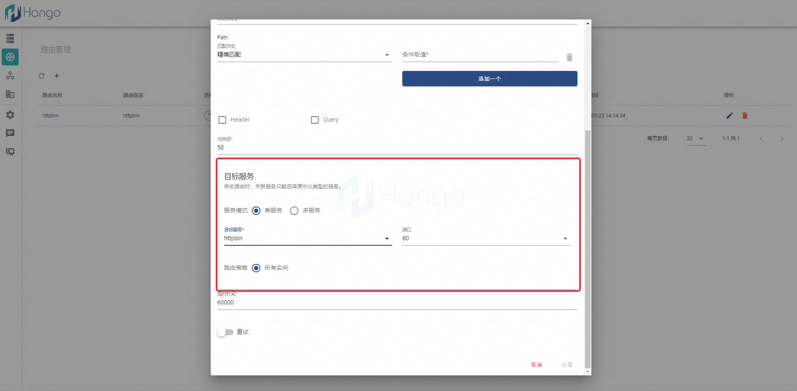

# 路由管理

> 支持版本: v1.3.0+

## 1.路由概念

`路由`是Hango网关的核心概念之一，代表着通过Hango网关的请求转发和选择路径的方式，是服务的下级概念，必须与`已发布服务`绑定

## 2.创建路由

通过`路由管理`界面创建路由数据，包括路由的path等各个维度的匹配规则


每一条路由都需要与服务进行关联；路由配置框中选择了目标网关后，才可以进行服务关联的操作，当前支持路由关联一个或多个服务（仅支持HTTP类型服务），从而达到服务灰度的效果；全部配置填写完成后点击确认，若路由状态为`启用`则正常创建一条路由数据



路由支持配置路由的超时时间、重试机制

## 4.管理路由

`路由管理`界面可以对路由进行修改和下线管理，点击如下操作按钮即可对路由进行修改或下线


## 5.访问路由

> 注意：网关地址已暴露到集群外，否则仅在集群内可访问

路由发布后，已经可以通过Hango网关对指定已发布路由进行访问

获取到当前网关的访问信息，包括地址和域名，以如下方式进行访问（以curl命令为例）

> 网关地址 = Envoy暴露地址:创建的虚拟网关端口

```shell
## {{}} 需要根据实际环境替换变量
curl "{{ 网关地址 }}/{{ 路由path }}" -H "{{ 网关域名 }}"
```