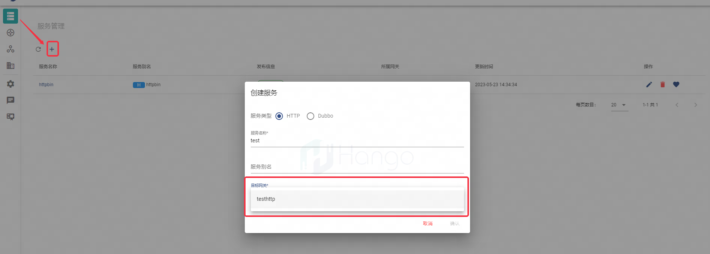
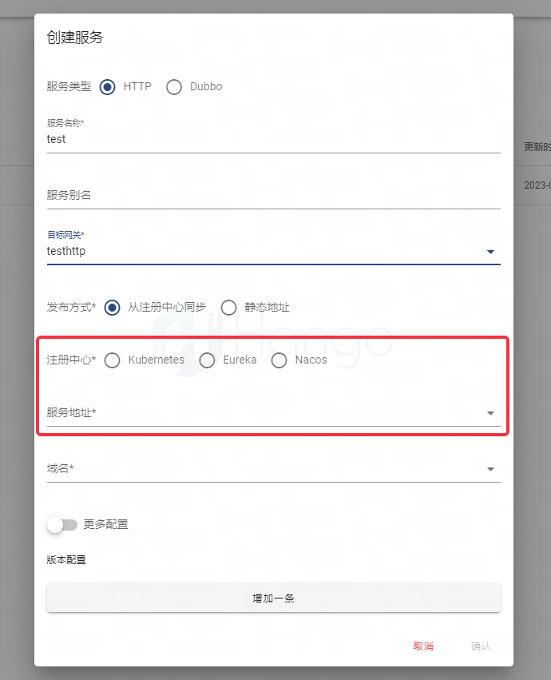

# 服务管理

> 支持版本: v1.3.0+

## 1.服务概念

`服务`是Hango网关的核心概念之一，代表着通过Hango网关的请求将发送至哪个服务，Hango网关的服务也是各种类型服务的总称，包括例如http、dubbo等

## 2.创建服务

通过`服务管理`界面创建服务数据，由上述步骤创建虚拟网关后，可以在虚拟网关选择栏中看到，选择后继续填写发布信息

选择服务的来源（k8s\Eureka\Nacos），并选择服务关联的域名，域名来源于虚拟网关

打开`更多配置`后可以看到更多属于服务的高阶功能，根据使用的需要进行配置，功能如下列表所示

- 负载均衡
- 连接池
- 版本配置

## 3.下线服务

`服务管理`界面可以对服务进行下线，点击如下操作按钮即可对服务进行下线

## 4.服务健康检查

已发布服务可以配置主动和被动2种类型的健康检查，以对服务中的实例进行纳管和驱逐，入口如下图所示

- 主动健康检查：对于指定接口和状态码进行定时检查，对于不符合响应码或超时的服务实例进行驱逐

- 被动健康检查：对于500的响应进行判断，驱逐不健康服务实例