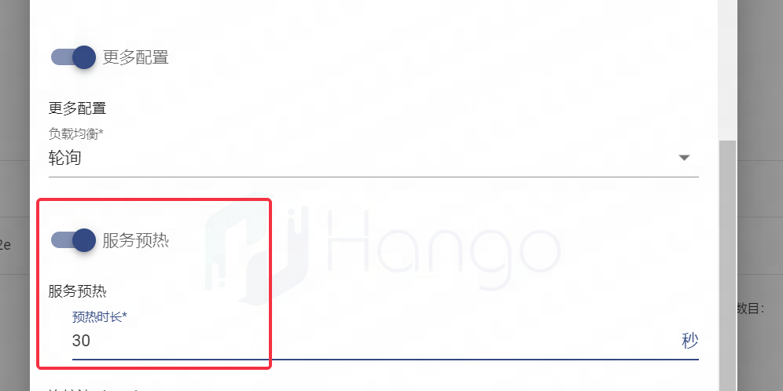

# 服务预热

> 支持版本: v1.6.1+

Hango网关支持对新加入服务集群的实例进行流量从小到大分配的能力，我们称为服务预热功能

大部分解释性语言都具备即时编译特性（JIT），在服务启动初期阶段接口响应较慢。在服务刚启动过程中，还会存在数据库建连等过程，因此部分服务刚启动的过程无法接受大并发的流量，需要网关具备流量预热功能，使得流量能够在周期内缓慢打向刚启动的服务实例，减少由于后端慢启动造成的流量异常

## 功能说明

虚拟网关类型：所有

操作位置：服务管理-创建服务-更多配置

使用约束：仅在负载均衡策略为`轮询`和`最小连接`两种情况下允许配置

## 配置说明

服务预热功能开关在服务中配置，可以通过`创建服务-更多配置`开关，支持服务预热的时间窗口配置，将在预热窗口中类线性增加新增服务实例的流量，达到服务预热的效果

## 使用指导

配置完服务的预热开关后，例如配置300s内服务预热，则对于后续该服务的实例上线（上线指Hango数据面感知到服务新实例IP），将在300s周期内对新实例缓慢进行流量分配