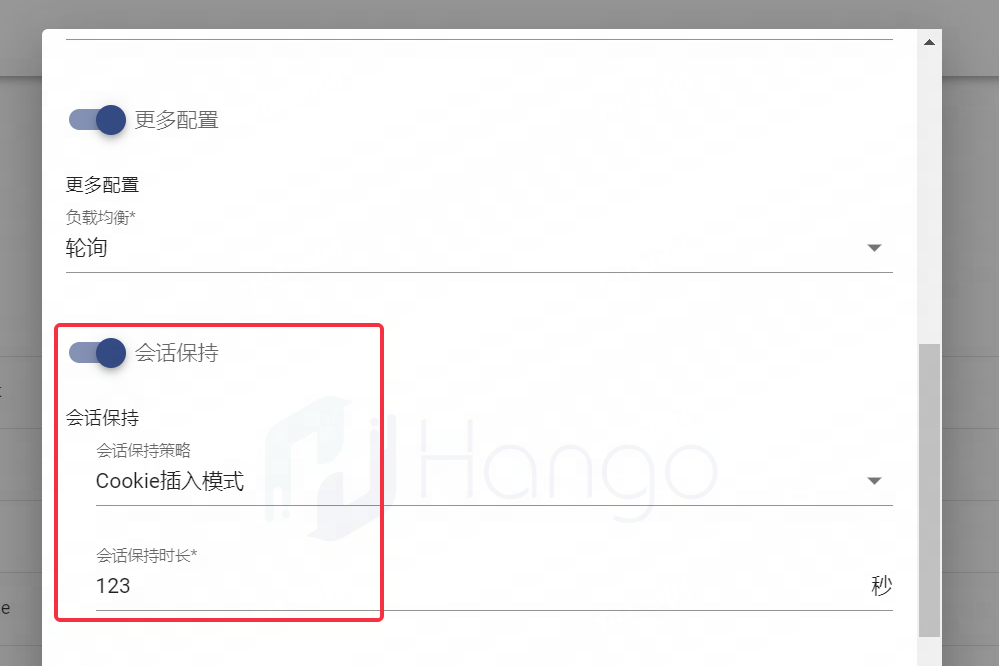

# 会话保持

> 支持版本: v1.7.1+

会话保持功能支持用户和统一后端服务进行交互，进而保证会话上下文信息不丢失，例如在使用到session存储的客户端应用中起到重要作用

## 能力说明

虚拟网关类型：仅负载均衡网关支持

操作位置：服务管理-创建服务-更多配置

会话保持是指在负载均衡器上的一种机制，可以识别客户端与服务器之间交互过程的关连性，在作负载均衡的同时还保证一系列相关连的访问请求会保持分配到一台服务器上

## 配置说明

会话保持功能当前支持Cookie维度，支持会话保持有效时间配置，通过`创建服务-更多配置`进行设置



## 使用指导

使用hango-system命名空间下的e2e服务demo配置会话保持，并发布路由，测试会话保持功能

第一次访问的返回内容如下

```shell
curl  -i -H "Host:59.111.243.66" 10.178.193.98:8080/e2e
# 会获取如下信息
HTTP/1.1 200 OK
date: Fri, 18 Aug 2023 07:08:53 GMT
content-length: 467
content-type: text/plain; charset=utf-8
x-envoy-upstream-service-time: 0
# 会话保持插件会在响应头中添加如下Cookie信息，
# 其中SERVERID="ChAxMC4xNzguMjU0LjcyOjgxEK24VA=="就是Cookie的K-V
# Max-Age是Cookie的过期时间
set-cookie: SERVERID="ChAxMC4xNzguMjU0LjcyOjgxEK24VA=="; Max-Age=15; Path=/; HttpOnly
server: istio-envoy
# Response Body Content
```

后续请求携带第一次请求中获取的Cookie信息，即可实现会话保持

```shell
curl  -i -H "Host:59.111.243.66" 10.178.193.98:8080/e2e  -H "Cookie:SERVERID=ChAxMC4xNzguMjU0LjcyOjgxEJW4VA=="
# 会获取如下信息
HTTP/1.1 200 OK
date: Fri, 18 Aug 2023 07:08:53 GMT
content-length: 467
content-type: text/plain; charset=utf-8
x-envoy-upstream-service-time: 0
# 会话保持插件会在响应头中添加如下Cookie信息
set-cookie: SERVERID="ChAxMC4xNzguMjU0LjcyOjgxEK24VA=="; Max-Age=15; Path=/; HttpOnly
server: istio-envoy

# Response Body Content
# 会话保持是否生效，可通过e2e请求返回内容中的Hostname确定
Hostname=apigw-demo-v1-846f969fd4-4xhkk
```