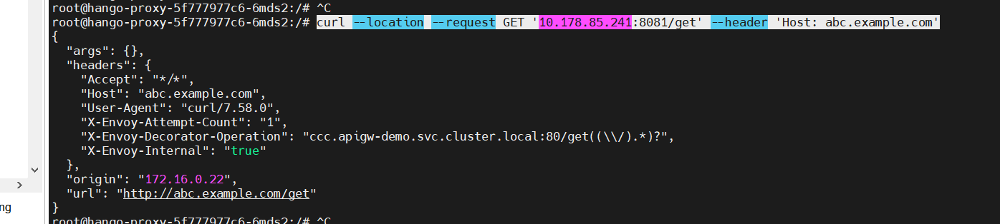
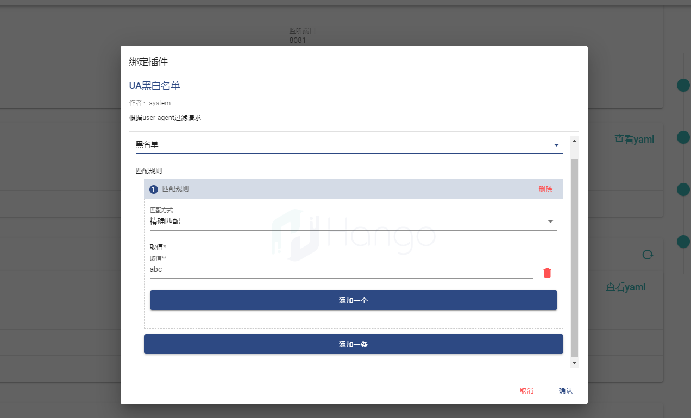

> 支持版本: v1.3.0+
## 1.Kubernetes Gateway概念
Gateway API作为Kubernetes入口网关的最新成果，得到行业的广泛支持。它代表了Ingress功能的一个父集，定义了一系列以Gateway资源为中心的资源集合。与Ingress类似，Kubernetes 中没有内置Gateway API默认实现，需要依赖基础设施商提供Gateway Class。
官方文档见：https://gateway-api.sigs.k8s.io
## 2.相关说明


  作为Ingress资源的升级，Gateway API提供了一系列治理能力更强、表达性更优、可扩展性更高的资源集合，其中GatewayClass、Gateway和HTTPRoute已经进入Beta阶段，其他CRD还处于实验阶段。
  此处只需要关注Gateway和xRoute资源，详细的API定义可参考[Gateway API](https://istio.io/latest/zh/docs/tasks/traffic-management/ingress/gateway-api/)

 * GatewayClass：

  GatewayClass是由基础架构提供商定义的集群范围的资源，该资源用于指定对应的Gateway Controller。目前已实现的Gateway Controller的产品包括Envoy Gateway（beta）、Istio（beta）、Kong（beta）等，详情可参考[Gateway Controller](https://gateway-api.sigs.k8s.io/implementations/#implementation-status)

* Gateway：

  核心网关资源，主要规范了以下三部分内容：

  -- Listeners：网关监听器列表，每个监听器都代表了一组主机名、端口、协议配置。

  -- GatewayClassName：用于指定生效的GatewayClass。

  -- Address：定义网关代理的请求地址。
  
* xRoute：

  代表需要不同特性协议的路由资源，每种协议路由都有特定的语义，这种模式具有较好的扩展性，例如可以定义DubboRoute、gRPCRoute等。每种资源都定义了基本的匹配、过滤和路由规则，这些规则只有被绑定到相应的Gateway资源上才可以生效。目前只有HTTPRoute进入Beta阶段。
## 3.技术架构图
  以下为Kubernetes Gateway在hango的功能实现架构图，Gateway API在控制台被创建之后会被开源的Istio控制面将Gateway API对象转换为Istio API对象，最终下发至Envoy数据面。
  hango在此基础之上对HttpRoute做了插件上的增强，提供了更多丰富的插件能力。

## 4.操作步骤
### 4.1、创建GatewayAPI CRD
在大多数 Kubernetes 集群中，默认情况下不会安装 Gateway API。如果 GatewayAPI CRD 不存在，请安装
```shell
kubectl apply -f https://github.com/kubernetes-sigs/gateway-api/releases/download/v0.6.1/standard-install.yaml -n hango-system
```
### 4.2、创建测试的上游服务
在命名空间 hango-system下创建流量要转发到的相关服务,以下为用于测试的httpbin服务
```shell
kubectl apply -f - <<EOF
apiVersion: apps/v1
kind: Deployment
metadata:
  name: demo-e2e
  namespace: hango-system
spec:
  replicas: 1
  selector:
    matchLabels:
      app: demo-e2e
  template:
    metadata:
      labels:
        app: demo-e2e
    spec:
      containers:
        - name: demo-e2e
          image: docker.io/hangoio/httpbin
          ports:
            - containerPort: 80
---
apiVersion: v1
kind: Service
metadata:
  name: demo-e2e
  namespace: hango-system
  labels:
    app: demo-e2e
spec:
  type: ClusterIP
  selector:
    app: demo-e2e
  ports:
    - port: 80
      targetPort: 80
EOF
```
### 4.2、创建Gateway的CRD资源
```shell
kubectl apply -f - <<EOF
apiVersion: gateway.networking.k8s.io/v1beta1
kind: Gateway
metadata:
  name: demo-gateway
  #固定值
  labels:
    istio.io/rev: gw-1.12 
  namespace: hango-system
  #固定值
  annotations:
    hango.io/gateway.project: "1" 
spec:
#addresses字段指定k8s Gateway作用的网关，若不指定，istio会自动为每一个k8s Gateway生成Service和Deployment作为网关代理。
#type字段只支持Hostname类型，value为envoy proxy的 service地址，并且要求 serive中已开放了listener中的端口，否则gateway无法生效。
  addresses:
    - type: Hostname
      value: hango-proxy.hango-system.svc.cluster.local
  #开源社区控制面Istio来承担Gateway Controller的职责，因此需要指定gatewayClassName：istio
  gatewayClassName: istio 
  listeners:
    - name: http
      protocol: HTTP
      port: 80
      allowedRoutes:
        namespaces:
          from: All
      #Gateway要路由到HOST，请求时需要将该Host携带在header里，并且HttpRoute需要是该host的子集
      hostname: '*.example.com' 
EOF
```
更多Gateway参数详细信息见官方文档：
https://gateway-api.sigs.k8s.io/references/spec/#gateway.networking.k8s.io/v1beta1.Gateway
### 4.3、创建HttpRoute的CRD资源
```shell
kubectl apply -f - <<EOF
apiVersion: gateway.networking.k8s.io/v1beta1
kind: HTTPRoute
metadata:
  name: demo-httpRoute
  labels:
    istio.io/rev: gw-1.12
  namespace: hango-system
spec:
  parentRefs:
    - name: demo-gateway
  hostnames:
    - "abc.example.com"
  rules:
    - matches:
        - path:
            type: PathPrefix
            value: /get
      backendRefs:
        - group: ""
          kind: Service
          name: demo-e2e
          namespace: hango-system
          port: 80
          weight: 1
    - backendRefs:
        - group: ""
          kind: Service
          name: httpbin
          namespace: hango-system
          port: 80
          weight: 1
      matches:
        - path:
            type: PathPrefix
            value: /status
EOF
```
更多HttpRoute详细参数见官方文档：
https://gateway-api.sigs.k8s.io/references/spec/#gateway.networking.k8s.io/v1beta1.HTTPRoute

### 4.4、页面同步GatewayAPI

hango虚拟网关点击刷新，后台创建的GatewayAPI将会被回显


### 4.5、在控制台请求演示
```shell
curl --location --request GET '10.178.85.241:80/get' --header 'Host: abc.example.com'
```
其中```10.178.85.241:80```需要改为实际的数据面Envoy的地址


### 4.6、插件增强
GatewayAPI可以通过在HTTPRoute中添加Filter实现插件的配置，
目前Istio只支持```HTTPRouteFilterRequestHeaderModifier```、```HTTPRouteFilterRequestRedirect```和```HTTPRouteFilterRequestMirror```
```shell
kubectl apply -f - <<EOF
apiVersion: gateway.networking.k8s.io/v1beta1
kind: HTTPRoute
metadata:
  name: demo-httpRoute
  labels:
    istio.io/rev: gw-1.12
  namespace: gateway-system
spec:
  parentRefs:
  - name: demo-gateway
  hostnames:
  - "abc.example.com"
  rules:
  - matches:
    - path:
        type: PathPrefix
        value: /get
    backendRefs:
    - group: ""
      kind: Service
      name: demo-e2e
      namespace: gateway-system
      port: 81
      weight: 1
    # 多个filter在此追加
    filters:
      - type: RequestHeaderModifier
        requestHeaderModifier:
          add:
            - name: my-header
              value: foo
EOF
```
上述yaml配置已将istio原生自带的RequestHeaderModifier插件进行集成，hango网关的插件功能基础之上进行扩展。
下图回显的是Gateway 绑定了的HTTPRoute的hostname


通过页面进行绑定插件



请求验证结果：

