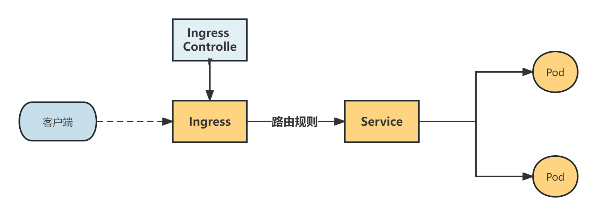
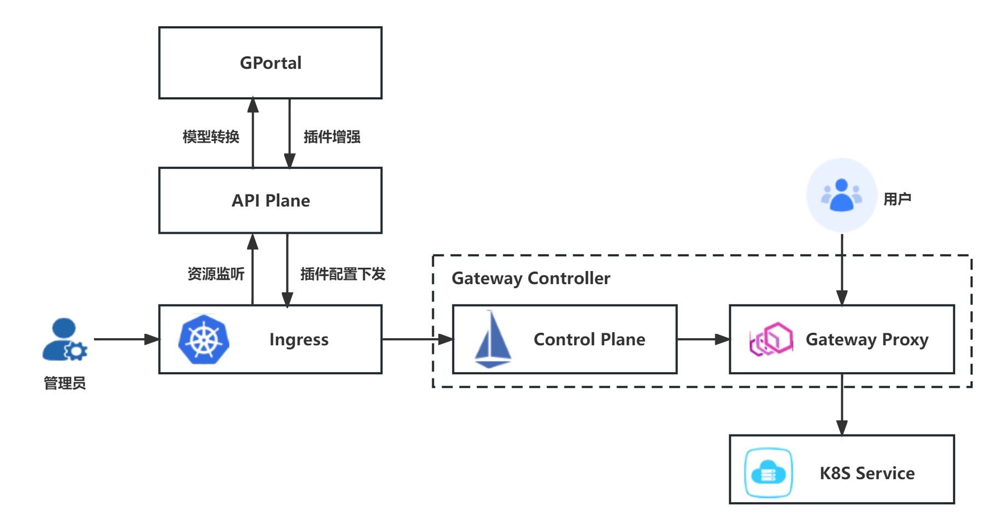
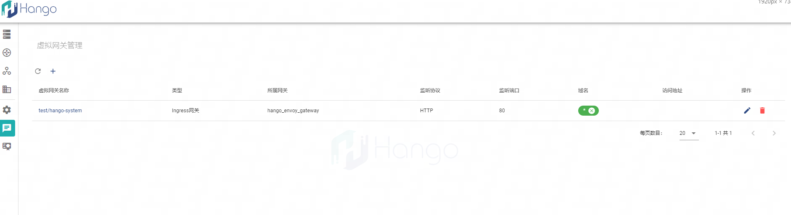
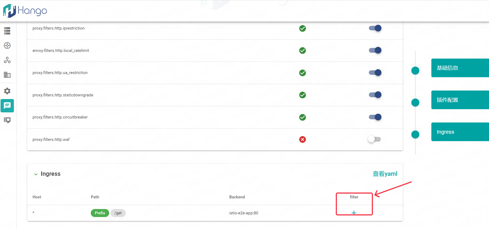
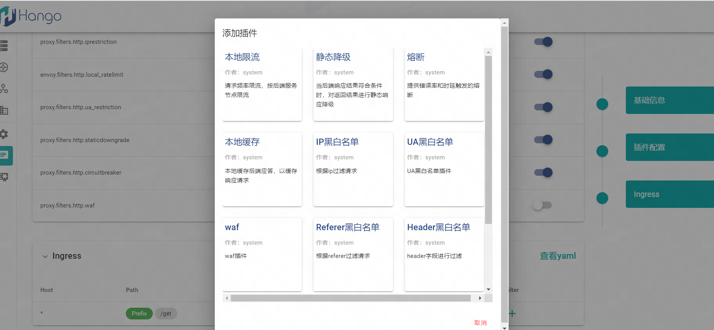

> 支持版本: v1.5.0+
## 1.Ingress 功能概述
   Ingress是K8s生态中定义流量入口的一种资源，但其只是个规则，仅创建Ingress资源本身是没有任何效果的，想让其生效，就需要有一个Ingress Controller去监听K8s中的ingress资源，
   并对这些资源进行规则解析，转换为其数据面中的代理规则，并由数据面来进行流量转发。当前K8s默认的Ingress Controller实现是Nginx，本次方案描述如何将通用网关纳管Ingress的流量。
   
## 2.相关说明
   Ingress资源是对集群中服务的外部访问进行管理的 API 对象，可以将集群内部服务通过HTTP或HTTPS暴露出去，流量路由规则由Ingress资源定义。
   
   目前只支持Ingress v1版本流量纳管，v1版本的Ingress资源定义如下：
   ```yaml
   ##ingress v1
   apiVersion: networking.k8s.io/v1
   kind: Ingress
   metadata:
      annotations:
         kubectl.kubernetes.io/last-applied-configuration: |
            {"apiVersion":"networking.k8s.io/v1","kind":"Ingress","metadata":{"annotations":{"kubernetes.io/ingress.class":"istio"},"name":"test","namespace":"hango-system"},"spec":{"ingressClassName":"istio","rules":[{"http":{"paths":[{"backend":{"service":{"name":"istio-e2e-app","port":{"number":80}}},"path":"/get","pathType":"Prefix"}]}}]}}
         kubernetes.io/ingress.class: hango
         skiff.netease.com/project: hango
      creationTimestamp: "2023-07-14T07:33:17Z"
      generation: 7
      name: test
      namespace: hango-system
      resourceVersion: "9320368"
      labels:
        istio.io/rev: gw-1.12
      uid: 1ba7e839-da43-4c00-afeb-85d173911003
   spec:
      rules:
         - http:
              paths:
                 - backend:
                      service:
                         name: istio-e2e-app
                         port:
                            number: 80
                   path: /get
                   pathType: Prefix
   status:
      loadBalancer:
         ingress:
            - ip: xxx.xxx.xxx.xxx
       
   ```
Ingress v1版本的资源定义中，主要包含以下几个重要注解：

* istio.io/rev：指定网关版本，目前只支持gw-1.12
* kubernetes.io/ingress.class：指定ingress的class，目前固定为hango
* skiff.netease.com/project：指定项目ID，目前固定为hango
* spec.rules：指定ingress的路由规则，目前只支持http协议
* status.loadBalancer.ingress：指定ingress的访问地址


## 3.技术架构图


## 4.操作步骤
### 4.1、创建测试的上游服务
在命名空间 hango-system下创建流量要转发到的相关服务,以下为用于测试的httpbin服务

```shell
kubectl apply -f - <<EOF
apiVersion: apps/v1
kind: Deployment
metadata:
  name: demo-e2e
  namespace: hango-system
spec:
  replicas: 1
  selector:
    matchLabels:
      app: demo-e2e
  template:
    metadata:
      labels:
        app: demo-e2e
    spec:
      containers:
        - name: demo-e2e
          image: docker.io/hangoio/httpbin
          ports:
            - containerPort: 80
---
apiVersion: v1
kind: Service
metadata:
  name: demo-e2e
  namespace: hango-system
  labels:
    app: demo-e2e
spec:
  type: ClusterIP
  selector:
    app: demo-e2e
  ports:
    - port: 80
      targetPort: 80
EOF
```
### 4.2、创建Ingress资源
```shell
kubectl apply -f - <<EOF
apiVersion: networking.k8s.io/v1
kind: Ingress
metadata:
  annotations:
    kubernetes.io/ingress.class: hango
    skiff.netease.com/project: hango
  labels:
    istio.io/rev: gw-1.12
  name: test
  namespace: hango-system
spec:
  rules:
  - http:
      paths:
      - backend:
          service:
            name: istio-e2e-app
            port:
              number: 80
        path: /get
        pathType: Prefix
status:
  loadBalancer: {}
EOF
```
### 4.4、页面同步Ingress资源
hango虚拟网关点击刷新，后台创建的ingress将会被回显到页面上，如下图所示：


### 4.5、在控制台请求演示
```shell
curl --location --request GET '10.178.70.129:80/get'
```
其中```10.178.70.129:80```需要改为实际的数据面Envoy的地址
### 4.6、插件增强
Ingress通过注解的方式进行扩展，目前包含的注解有ingress注解，但istio官方并未对这些注解进行任何支持，因此当前没有任何增强功能。针对这种情况，我们可以通过envoyplugin的方式进行插件增强，和现有轻舟插件保持一致。
进入Ingress类型的虚拟网关内部


设置插件


