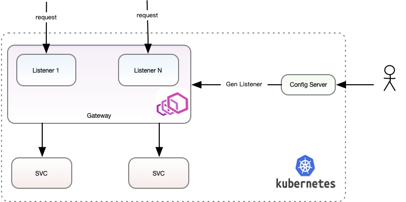
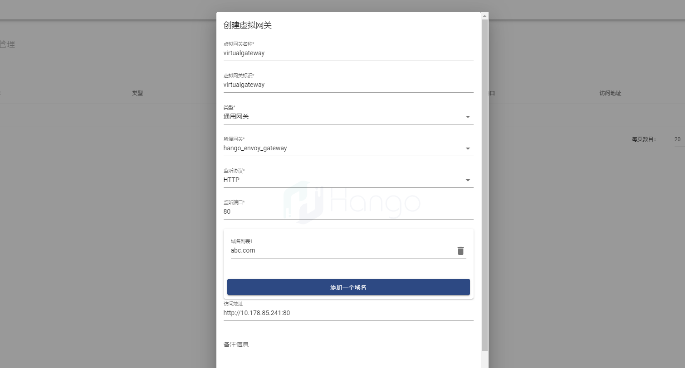
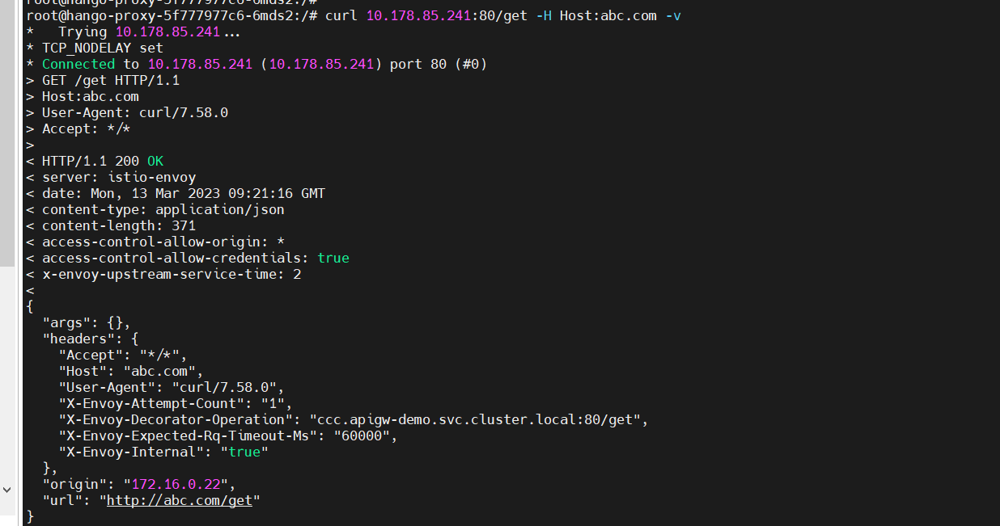

> 支持版本: v1.3.0+
## 1.虚拟网关概念
  在L7层通用网关中，一组Envoy网关集群可以表现出不同的形态，如API网关、L7负载均衡、ingress。网关集群在部署时已确定的一组网关实例，称之为网关，不同表现形态称之为```虚拟网关```。
依托于网关，可通过不同场景进行配置。网关数据层采用Envoy作为底层代理，通过不同的Listener配置开放Envoy不同的监听端口，对应不同形态的虚拟网关。
## 2.功能架构图
  一组Envoy网关实例部署在Kubernetes集群中，用户通过配置服务在网关生成Listener(虚拟网关)，Listener(虚拟网关)监听对应的服务，当有请求访问该监听端口时，进行流量转发。


## 3、虚拟网关类型与场景
  目前hango对虚拟网关的功能做了功能边界的划分，分为三类虚拟网关，分别是```通用网关```、```API网关```、```L7负载均衡```


 * 通用网关：通用网关涵盖了大部分网关的应用场景，在插件类型上最为丰富，功能也最为强大。 
 
 * API网关：API网关适用于需要对API进行统一管理和控制的场景，例如企业内部的API管理(目前仅商业版支持)、对外提供API服务的场景等。

 * 负载均衡：L7负载均衡是是将网络流量分配到多个服务器上的场景，以实现提高系统的性能和可靠性

以上三类虚拟网关类型对于插件支持的能力功能边界见表格：

| 系统插件         | 分类     | 通用网关   | API网关 | 负载均衡 |
| -------------- | -------- |--------| ------- | -------- |
| 百分比限流       | 流量管理 | √      | √       | X        |
| 本地限流         | 流量管理 | √      | √       | X        |
| IP黑白名单       | 安全     | √      | √       | √        |
| UA黑白名单       | 安全     | √      | √       | X        |
| Referer黑白名单  | 安全     | √      | √       | X        |
| Header黑白名单   | 安全     | √      | √       | X        |
| 响应头部重写     | 数据转换 | √      | √       | X        |
| 本地缓存         | 流量管理 | √      | √       | X        |
| 静态降级         | 流量管理 | √      | √       | X        |
| 熔断             | 流量管理 | √      | √       | X        |
| WAF            | 安全     | √      | √       | √        |

## 4、使用指导
### 4.1、创建虚拟网关
  可在虚拟网关管理中创建虚拟网关，填写必要的参数如下图所示：


需要关注的参数有：

* 虚拟网关标识：该标识用作虚拟网关唯一确认的标识，不可与其他虚拟网关重复
* 类型：虚拟网关目前支持的类型有：API网关、L7负载均衡、通用网关
* 监听端口：该虚拟网关的访问端口，不可与其他虚拟网关端口重复
* 域名列表：请求该虚拟网关时需要携带该域名列表中的任一域名才能请求得到该虚拟网关的路由
* 访问地址：这次访问地址的配置仅是展示的作用，用作展示虚拟网关暴露的访问地址

### 4.2、请求虚拟网关
创建虚拟网关之后，并创建发布服务与路由，请求该网关：

