# Hango插件市场

> 支持版本: v1.6.0+

Hango网关支持集成插件市场功能，补足了初版自定义插件不易集成的问题，进一步提升了易用性，允许用户通过配置插件市场来管理和使用各类自定义插件能力，以下罗列当前版本支持的插件类型、形态和作用域

注：v1.6.0版本当前仅开放Lua形态，后续版本会陆续开放WASM形态

| 插件类型 | 形态           | 范围  |
|------|--------------|-----|
| Lua  | 脚本、OCI（标准镜像） | 路由  |
| WASM | OCI（标准镜像）    | 路由  |

## 1.Lua插件使用引导

### 1.1.Lua代码

> 详细 API 可参考 [Rider SDK API](https://github.com/hango-io/rider/blob/main/docs/api.md)

以下定义一个简单Lua脚本，配置uri黑白名单，若请求中携带黑名单列表的字符串，则返回403

```Lua
require('rider.v2')

-- 定义本地变量
local envoy = envoy
local request = envoy.req
local respond = envoy.respond

-- 定义本地常量
local NO_MATCH = 0
local MATCH_WHITELIST = 1
local MATCH_BLACKLIST = 2
local BAD_REQUEST = 400
local FORBIDDEN = 403

local uriRestrictionHandler = {}

-- 定义本地常量
uriRestrictionHandler.version = 'v2'

local json_validator = require('rider.json_validator')

-- 定义全局配置
local base_json_schema = {
type = 'object',
properties = {}
}

-- 定义路由级配置
local route_json_schema = {
type = 'object',
properties = {
    allowlist = {
        type = 'array',
        items = {
            type = 'string'
        }
    },
    denylist = {
        type = 'array',
        items = {
            type = 'string'
        }
    }
}
}

json_validator.register_validator(base_json_schema, route_json_schema)

-- 定义本地校验uri黑白名单方法
local function checkUriPath(uriPath, allowlist, denylist)
if allowlist then
    for _, rule in ipairs(allowlist) do
        envoy.logDebug('allowist: compare ' .. rule .. ' and ' .. uriPath)
        if string.find(uriPath, rule) then
            return MATCH_WHITELIST
        end
    end
end

if denylist then
    for _, rule in ipairs(denylist) do
        envoy.logDebug('denylist: compare ' .. rule .. ' and ' .. uriPath)
        if string.find(uriPath, rule) then
            return MATCH_BLACKLIST
        end
    end
end

return NO_MATCH
end

-- 定义request的header阶段处理函数
function uriRestrictionHandler:on_request_header()
local uriPath = request.get_header(':path')
local config = envoy.get_route_config()

if uriPath == nil then
    envoy.logErr('no uri path!')
    return
end

-- 配置未定义报错
if config == nil then
    envoy.logErr('no route config!')
    return
end

local match = checkUriPath(uriPath, config.allowlist, config.denylist)

envoy.logDebug('on_request_header, uri path: ' .. uriPath .. ', match result: ' .. match)

if match > 1 then
    envoy.logDebug('path is now allowed: ' .. uriPath)
    return respond({[':status'] = FORBIDDEN}, 'Forbidden')
end
end

return uriRestrictionHandler
```

### 1.2.本地调测

Envoy支持本地对Lua插件的调试，但在调试前需要准备以下资源：

#### 安装docker-compose

开发环境必须安装docker-compose，如果没有需要先安装 https://docs.docker.com/compose/install/

#### 下载Rider SDK

通过git下载Rider SDK，以下基于SDK本地开发和调试WASM插件

```shell
git clone https://github.com/hango-io/rider.git
```

#### 配置envoy.yaml


通过rider组件进行本地调测，整体调试流程与wasm基本一致，不同点在于修改`rider/scripts/dev/envoy.yaml`文件的`proxy.filters.http.rider`filter，将该filter下的filename修改为正确的名称

首先打开`rider/script/dev/envoy.yaml`配置文件，找到filename字段将值改为`/usr/local/lib/rider/uri-restriction.lua`，用于指定envoy在容器内加载脚本的路径，name改为`uri-restriction`，完整配置如下

```yaml
- name: proxy.filters.http.rider
  typed_config:
    "@type": type.googleapis.com/proxy.filters.http.rider.v3alpha1.FilterConfig
    plugin:
      vm_config:
        package_path: "/usr/local/lib/rider/?/init.lua;/usr/local/lib/rider/?.lua;"
      code:
        local:
          filename: /usr/local/lib/rider/uri-restriction.lua
      name: uri-restriction
```

第二步修改找到` Plugin config here applies to the Route `这一行,将配置修改为如下配置

```yaml
typed_per_filter_config:
  proxy.filters.http.rider:
    "@type": type.googleapis.com/proxy.filters.http.rider.v3alpha1.RouteFilterConfig
    plugins:
      - name: uri-restriction
        config:
          allowlist:
            - a1
          denylist:
            - d1
```

#### 执行启动脚本验证

然后执行`./scripts/dev/local-up.sh -f`启动envoy和一个简单的HTTP服务。该HTTP服务的作用是将请求的详情放入响应中并返回给调用方。
通过`curl -v http://localhost:8002/static-to-header`，调用截图如下：

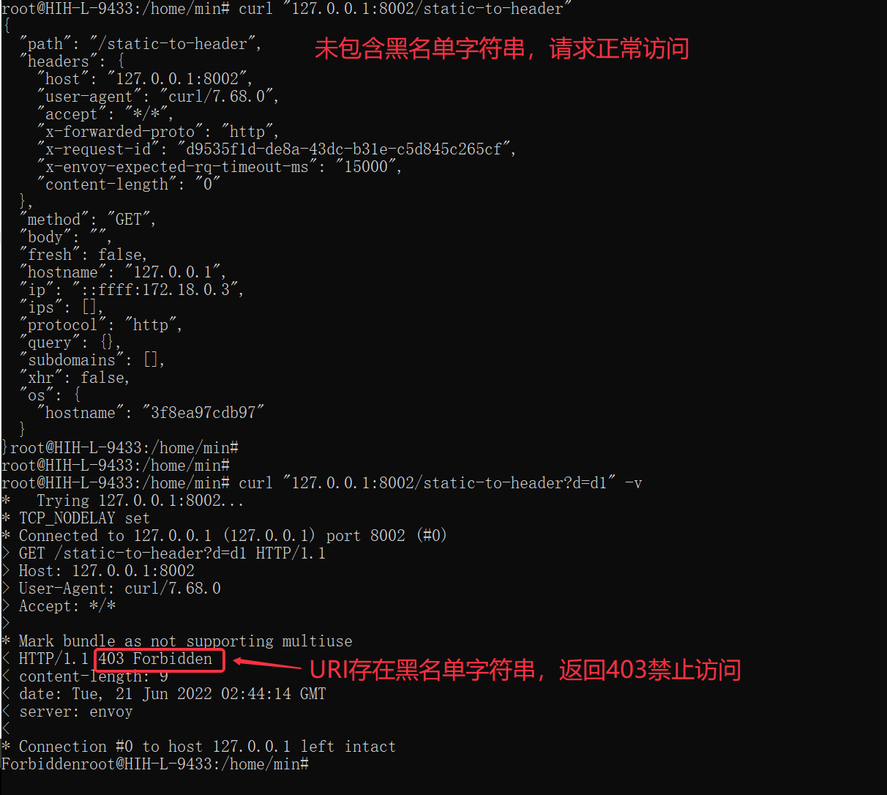

### 1.3.插件表单

插件市场插件支持基于schema表单的形式实现插件的可视化声明，具体支持的表单组件在插件市场默认页面均有演示，并且支持点击`插件校验`按钮进行表达数据提交校验

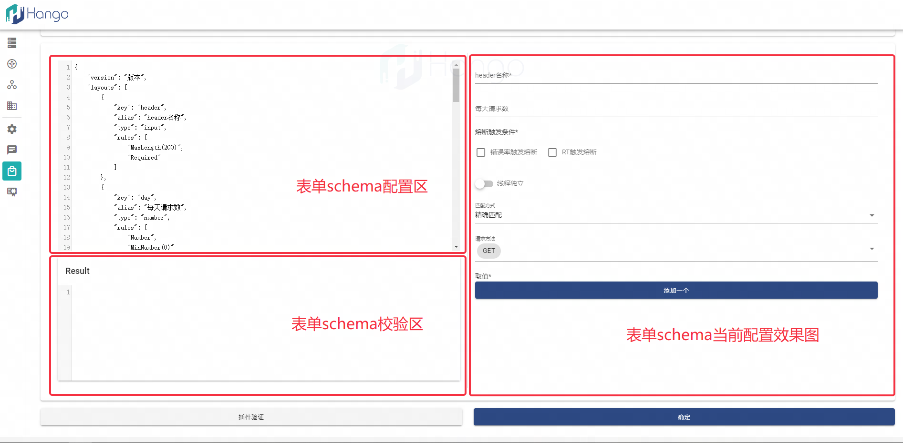

与案例Lua脚本对应的表单（schema）如下，该表单用于声明插件的配置参数格式，后续插件实例的配置格式均插件市场配置的表达格式

```json
{
  "layouts": [
    {
      "key": "allowlist",
      "alias": "白名单",
      "help": "URI优先匹配白名单，命中之后直接放行，支持正则",
      "type": "multi_input",
      "rules": []
    },
    {
      "key": "denylist",
      "alias": "黑名单",
      "help": "URI优先匹配白名单，没有命中，继续匹配黑名单，命中之后直接禁止，支持正则",
      "type": "multi_input",
      "rules": []
    }
  ]
}
```

### 1.4.插件上传

插件上传Lua支持两种类型，分别如下

| 上传类型      | 说明                                                |
|-----------|---------------------------------------------------|
| Lua脚本文件上传 | 脚本文件通过ConfigMap形式挂载，存在一定延迟（一般10-20s）              |
| OCI镜像上传   | 镜像下载需要保证镜像存在，若非docker hub的镜像，需要填写secret名称完成镜像仓库授权 |

#### 脚本上传

插件市场界面选择`本地文件`单选项，会出现`脚本文件上传`按钮，点击上传Lua格式脚本

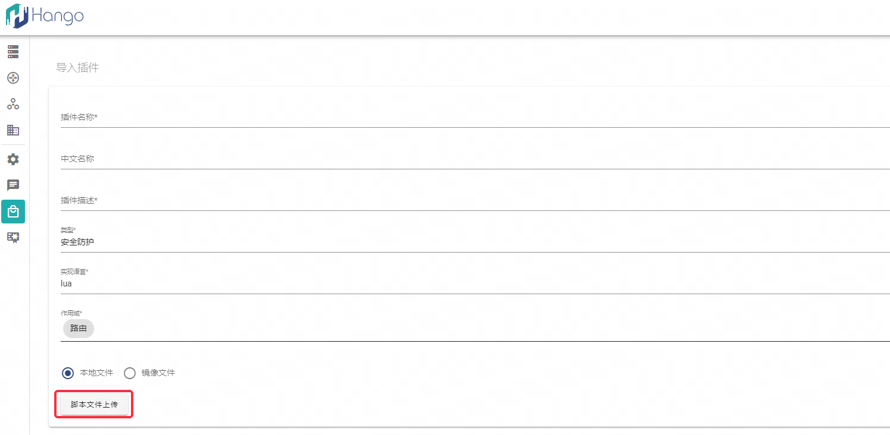

#### 镜像上传

镜像模式需要配置标准OCI镜像，可参考本文1.7段落案例

首先需要基于Dockerfile完成镜像打包，参考如下提供的Dockerfile，其中拷贝到容器内的目标文件名必须是`plugin.lua`

```Dockerfile
FROM scratch
COPY main.lua plugin.lua
```

如下是一个精简的打镜像命令，可以参考Docker官方文档进行镜像打包（需要注意打镜像的架构问题，与环境架构不同的镜像无法运行）

```shell
docker build -t [镜像名称] .
```

### 1.5.上架插件

完成插件配置后，需要手动上架插件

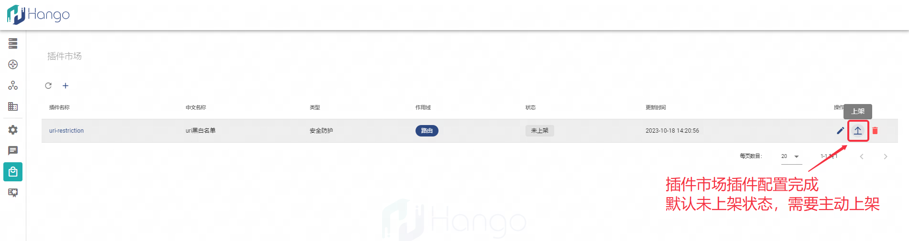

完成插件上后，虚拟网关下的插件列表会新增该自定义插件（默认关闭状态），使用自定义插件前需手动打开开关

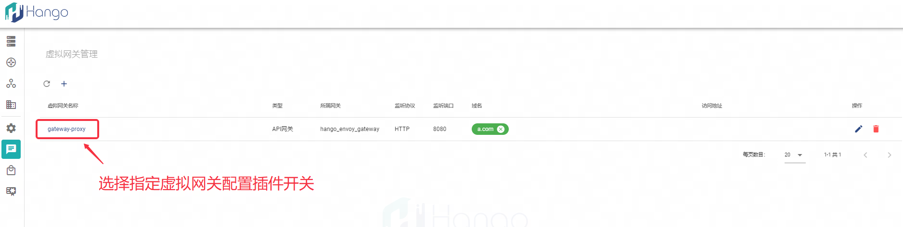

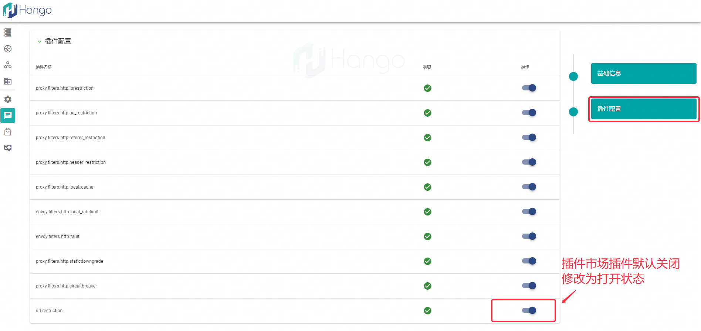

### 1.6.测试配置插件实例

进入Hango的`插件管理`栏，为指定路由进行插件配置，上架插件可以在插件列表中查看到并进行配置

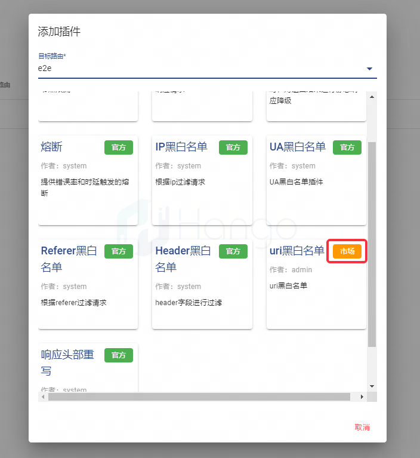

为自定义插件`uri黑白名单`配置如下内容，配置黑名单列表`deny1`和`deny2`

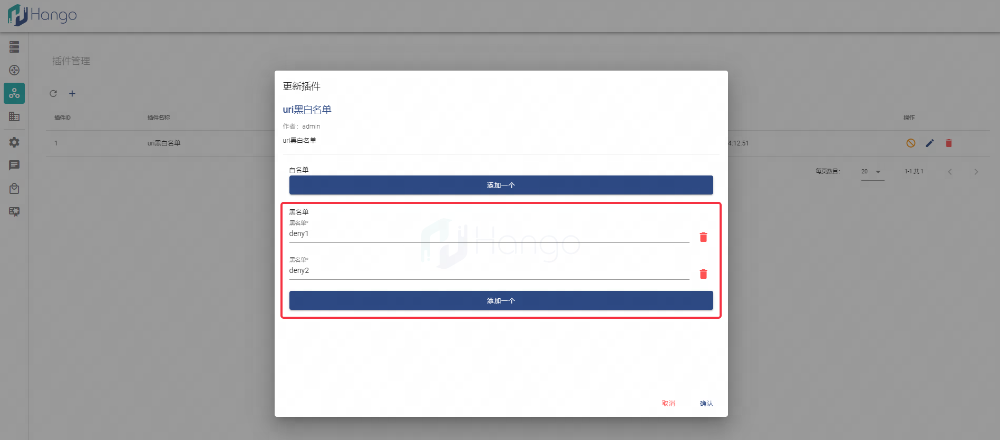

访问网关测试Lua脚本，结果如下

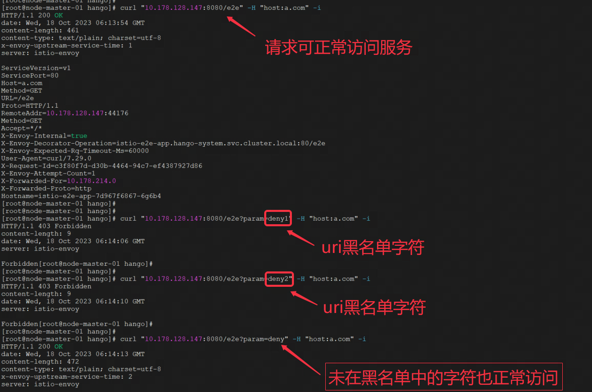

### 1.7.Lua案例

#### 案例1：模拟故障注入

本案例通过Lua的镜像模式进行演示，本案例展示了一个模拟故障注入的插件，支持延迟模拟和响应码、响应体模拟

##### 镜像

```shell
docker.io/hangoio/2.11mainlua:v1
```

##### 镜像中的Lua脚本

```lua
require('rider')

-- 定义本地变量
local envoy = envoy
local request = envoy.req
local respond = envoy.respond

-- 定义本地常量
local NO_MATCH = false
local MATCH_CONDITION = true

local faultInjectHandler = {}


-- 定义request的header阶段处理函数
function faultInjectHandler:on_request()
    envoy.logInfo('start lua fault inject')

    local config = envoy.get_route_config()

    -- 配置未定义报错
    if config == nil then
        envoy.logErr('no config!')
        return
    end
    local condition = config.condition
    local delay = condition.delay;

    if delay ~= nil and delay.delaySwitch then
        envoy.logInfo('start delay inject!')
        os.execute("sleep " .. delay.delayTime / 1000) -- 等待指定的毫秒数
        envoy.logInfo('finish delay inject!')
        return
    end

    local error = condition.error;
    if error ~= nil and error.errorSwitch then
        if math.random(100) < error.errorPercent then
            return respond({[':status'] = error.errorCode}, error.errorBody)
        end
    end
    envoy.logInfo('finish lua fault inject')

end

return faultInjectHandler
```

##### 表单schema

```json
{
  "layouts": [
    {
      "key": "condition",
      "alias": "故障注入",
      "type": "layouts",
      "layouts": [
        {
          "key": "delay",
          "alias": "延时",
          "type": "layouts",
          "layouts": [
            {
              "key": "delaySwitch",
              "alias": "开启",
              "type": "switch",
              "default": false
            },
            {
              "key": "delayTime",
              "alias": "延时时间",
              "help": "注入指定时间的延时，单位(ms)",
              "placeholder": "请输入延时时间",
              "type": "number",
              "visible": {
                "this.delaySwitch": true
              },
              "rules": [
                "Required",
                "Number",
                "MinNumber(0)",
                "MaxNumber(5000)"
              ]
            }
          ]
        },
        {
          "key": "error",
          "alias": "错误",
          "type": "layouts",
          "layouts": [
            {
              "key": "errorSwitch",
              "alias": "开启",
              "type": "switch",
              "default": false
            },
            {
              "key": "errorPercent",
              "alias": "错误率",
              "visible": {
                "this.errorSwitch": true
              },
              "help": "0~100之间的整数, 代表错误注入比例",
              "type": "number",
              "placeholder": "请输入错误比例",
              "rules": [
                "Required",
                "Number",
                "MaxNumber(100)",
                "MinNumber(0)"
              ]
            },
            {
              "key": "errorCode",
              "type": "input",
              "default": "404",
              "alias": "错误码",
              "visible": {
                "this.errorSwitch": true
              },
              "rules": [
                "Required",
                "Number",
                "MinNumber(200)",
                "MaxNumber(599)"
              ]
            },
            {
              "key": "errorBody",
              "type": "input",
              "alias": "错误体",
              "visible": {
                "this.errorSwitch": true
              }
            }
          ]
        }
      ]
    }
  ]
}
```

##### 表单schema效果图

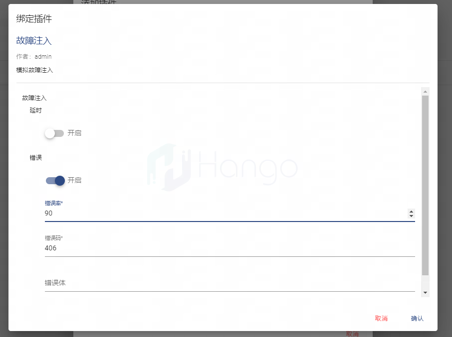

##### 请求结果

完成插件的上架、开关及配置后，请求网关，由于配置的概率是90%返回406响应码，实际请求大概率（按照脚本逻辑，由于用随机数模拟，非实际的90%概率）返回406响应码，结果如下图所示

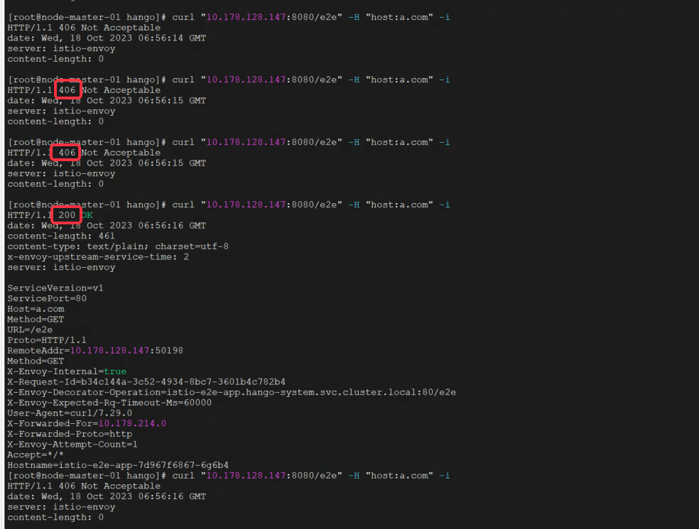

## 2.WASM插件使用引导

Wasm是WebAssembly的缩写，它是一种二进制格式，通常我们可以将种编程语言的代码，包括C++、Rust、Go等编译成Wasm二进制文件，只不过各个语言都有自己编译成wasm的工具，如C++和Rust都可以使用Proxy-Wasm提供的方式编译成Wasm脚本，而Go语言则可以使用TinyGo将Golang代码文件转为Wasm二进制文件。

本文以一份Go代码为例，演示Wasm类型插件在Hango插件市场的使用流程

### 2.1.准备Golang代码

以下是一份Go代码，内容是将我们配置参数写入响应头，go api详见：[proxy-wasm-go-sdk api](https://github.com/tetratelabs/proxy-wasm-go-sdk)

```go
package main

import (
	"strings"

	"github.com/tidwall/gjson"

	"github.com/tetratelabs/proxy-wasm-go-sdk/proxywasm"
	"github.com/tetratelabs/proxy-wasm-go-sdk/proxywasm/types"
)

func main() {
	proxywasm.SetVMContext(&vmContext{})
}

type vmContext struct {
	// Embed the default VM context here,
	// so that we don't need to reimplement all the methods.
	types.DefaultVMContext
}

// Override types.DefaultVMContext.
func (*vmContext) NewPluginContext(contextID uint32) types.PluginContext {
	return &pluginContext{}
}

type pluginContext struct {
	// Embed the default plugin context here,
	// so that we don't need to reimplement all the methods.
	types.DefaultPluginContext

	// headerName and headerValue are the header to be added to response. They are configured via
	// plugin configuration during OnPluginStart.
	headerName  string
	headerValue string
}

// Override types.DefaultPluginContext.
func (p *pluginContext) NewHttpContext(contextID uint32) types.HttpContext {
	return &httpHeaders{
		contextID:   contextID,
		headerName:  p.headerName,
		headerValue: p.headerValue,
	}
}

func (p *pluginContext) OnPluginStart(pluginConfigurationSize int) types.OnPluginStartStatus {
	proxywasm.LogDebug("loading plugin config")
	data, err := proxywasm.GetPluginConfiguration()
	if data == nil {
		return types.OnPluginStartStatusOK
	}

	if err != nil {
		proxywasm.LogCriticalf("error reading plugin configuration: %v", err)
	}

	if !gjson.Valid(string(data)) {
		proxywasm.LogCritical(`invalid configuration format; expected {"header": "<header name>", "value": "<header value>"}`)
	}

	p.headerName = strings.TrimSpace(gjson.Get(string(data), "header").Str)
	p.headerValue = strings.TrimSpace(gjson.Get(string(data), "value").Str)

	if p.headerName == "" || p.headerValue == "" {
		proxywasm.LogCritical(`invalid configuration format; expected {"header": "<header name>", "value": "<header value>"}`)
	}

	proxywasm.LogInfof("header from config: %s = %s", p.headerName, p.headerValue)

	return types.OnPluginStartStatusOK
}

type httpHeaders struct {
	// Embed the default http context here,
	// so that we don't need to reimplement all the methods.
	types.DefaultHttpContext
	contextID   uint32
	headerName  string
	headerValue string
}

// Override types.DefaultHttpContext.
func (ctx *httpHeaders) OnHttpRequestHeaders(numHeaders int, endOfStream bool) types.Action {
	err := proxywasm.ReplaceHttpRequestHeader("test", "best")
	if err != nil {
		proxywasm.LogCritical("failed to set request header: test")
	}

	hs, err := proxywasm.GetHttpRequestHeaders()
	if err != nil {
		proxywasm.LogCriticalf("failed to get request headers: %v", err)
	}

	for _, h := range hs {
		proxywasm.LogInfof("request header --> %s: %s", h[0], h[1])
	}
	return types.ActionContinue
}

// Override types.DefaultHttpContext.
func (ctx *httpHeaders) OnHttpResponseHeaders(_ int, _ bool) types.Action {
	proxywasm.LogInfof("adding header: %s=%s", ctx.headerName, ctx.headerValue)

	// Add a hardcoded header
	if err := proxywasm.AddHttpResponseHeader("x-proxy-wasm-go-sdk-example", "http_headers"); err != nil {
		proxywasm.LogCriticalf("failed to set response constant header: %v", err)
	}

	// Add the header passed by arguments
	if ctx.headerName != "" {
		if err := proxywasm.AddHttpResponseHeader(ctx.headerName, ctx.headerValue); err != nil {
			proxywasm.LogCriticalf("failed to set response headers: %v", err)
		}
	}

	// Get and log the headers
	hs, err := proxywasm.GetHttpResponseHeaders()
	if err != nil {
		proxywasm.LogCriticalf("failed to get response headers: %v", err)
	}

	for _, h := range hs {
		proxywasm.LogInfof("response header <-- %s: %s", h[0], h[1])
	}
	return types.ActionContinue
}

// Override types.DefaultHttpContext.
func (ctx *httpHeaders) OnHttpStreamDone() {
	proxywasm.LogInfof("%d finished", ctx.contextID)
}
```

### 2.2.go依赖下载声明

```shell
## 初始化当前项目名为"wasm"（名称可任意），会基于代码文件生成go.mod文件
go mod init wasm

## 下载依赖
go mod tidy
```

### 2.3.编译Wasm二进制文件

我们将上述文件编译为Wasm二进制文件，运行以下命令后我们可以看到同级目录下生成了main.wasm的二进制文件
```shell
tinygo build -o main.wasm -scheduler=none -target=wasi ./main.go
```

### 2.4.本地调测

Envoy支持本地对Wasm插件的调试，但在调试前需要准备以下资源：

#### 安装docker-compose

开发环境必须安装docker-compose，如果没有需要先安装 https://docs.docker.com/compose/install/

#### 下载Rider SDK

通过git下载Rider SDK，以下基于SDK本地开发和调试WASM插件

```shell
git clone https://github.com/hango-io/rider.git
```

#### 配置envoy.yaml

将main.wasm脚本放到rider/rider目录下，同时打开`rider/scripts/dev/envoy.yaml`配置文件，在插件名`envoy.filters.http.wasm`（若没有则添加，添加在`http_filters`节点下，`envoy.filters.http.router`节点之前）下找到filename字段，并将值改为`/usr/local/lib/rider/rider/main.wasm`（修改为该固定值即可，为容器内目录），用于指定envoy在容器内加载wasm脚本的路径，完整配置如下：

```yaml
          - name: envoy.filters.http.wasm
            typed_config:
              "@type": type.googleapis.com/envoy.extensions.filters.http.wasm.v3.Wasm
              config:
                name: "my_plugin"
                root_id: "my_root_id"
                configuration:
                  "@type": type.googleapis.com/google.protobuf.StringValue
                  value: |
                    {
                      "header": "x-wasm-header",
                      "value": "demo-wasm"
                    }
                vm_config:
                  vm_id: "my_vm_id"
                  runtime: "envoy.wasm.runtime.v8"
                  code:
                    local:
                      filename: "/usr/local/lib/rider/rider/main.wasm"
```

#### 执行启动脚本验证

切换到rider项目根目录下执行`./scripts/dev/local-up.sh -f`启动 envoy和一个简单的HTTP服务。该HTTP服务的作用是将请求的详情放入响应中并返回给调用方。

通过`curl -v http://localhost:8002/static-to-header`，可以观察到响应头返回：`x-wasm-header: demo-wasm`（即envoy.yaml文件内所填mock参数）

### 1.5.构建Docker镜像

Dockerfile如下，通过空镜像构建，将wasm文件拷贝至镜像，其中拷贝到容器内的目标文件名必须是`plugin.wasm`

```Dockerfile
FROM scratch
COPY main.wasm plugin.wasm
```

执行镜像构建命令，并将其推至远程镜像仓库

```shell
docker build -t docker.io/hangoio/wasm-rider:v1 .
docker push docker.io/hangoio/wasm-rider:v1
```

### 2.6.上传wasm插件

通过如下页面配置插件基本信息

// 待开放 Hango配置界面

以下是测试脚本对应的插件表单

```json
{
   "formatter": {
     "kind": "Security",
     "type": "wasm",
     "need_to_response": "&need_to_response",
     "config": {
       "header": "&header",
       "value": "&value"
     }
   },
   "layouts": [
     {
       "key": "header",
       "alias": "请求头key",
       "help": "",
       "type": "input"
     },
     {
       "key": "value",
       "alias": "请求头value",
       "type": "input"
     }
   ]
 }
```

// 待开放 插件样式图

完成插件配置后，在列表页面点击`上架插件`，并在网关的`插件配置`中打开插件开关，则当前配置的wasm插件为可用插件

// 待开放 开关图

### 2.7.配置插件实例

完成上述步骤后，wasm插件已经上传完毕，我们可以在指定的虚拟网关界面看到插件列表，并找到上传的wasm插件进行实例配置和使用

// 待开放 实例图